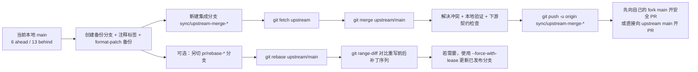

# Fork 仓库在保留本地提交前提下合并上游变更的深度研究报告

## 执行摘要

对你当前这类场景——本地 `jdsyui2/daily_stock_analysis` 相对上游 `ZhuLinsen/daily_stock_analysis:main` 处于 **6 个本地提交待保留、13 个上游提交待吸收**——最稳妥的主流程不是直接在现有分支上 `git pull`，而是先做**三重保险**（备份分支、注释标签、补丁导出），再在**新的集成分支**上显式 `fetch upstream` 后执行 `merge upstream/main`。这样做的核心好处是：你的 6 个本地提交不会被重写，冲突通常只需要处理一次，失败时也最容易回滚。与之相比，`rebase` 会把本地提交“重放”为新提交，历史更干净，但一旦这些提交已经共享出去，风险会明显升高；`cherry-pick` 最适合“只挑其中几条提交去上游”的手术式场景。 citeturn6search2turn26view0turn11view1turn12view5turn12view3

我同时检查了你已连接的两个 GitHub 仓库：urljdsyui2/daily_stock_analysishttps://github.com/jdsyui2/daily_stock_analysis 的 PR CI 会在 `main` 上跑后端 gate、Docker 构建与按路径触发的前端 gate；该仓库的 `.gitattributes` 已经为 `docs/CHANGELOG.md` 配置了 `merge=union`。urlchenyiyun2087/AShareDataCenterhttps://github.com/chenyiyun2087/AShareDataCenter 则有较严格的质量门、契约测试和运行手册，其中 `tests/contracts/test_stage3_api_contract.py` 明确引用了 `daily_stock_analysis_8001`。这意味着你对 `daily_stock_analysis` 的同步，不只是历史整理问题，也可能影响下游集成契约与回归。 fileciteturn12file0L1-L1 fileciteturn14file0L1-L1 fileciteturn16file0L1-L1 fileciteturn17file0L1-L1

因此，我的结论是：

- **默认推荐**：**备份 → 新建集成分支 → merge upstream/main → 本地跑 CI 镜像验证 → push 新分支 → 开 PR**。这是最低风险、最符合“先保住 6 个本地提交”的方案。 citeturn12view5turn12view6turn21view1
- **若最终目标是给上游提交一个更干净的 PR**：先按上面的 merge 流程完成一次“安全集成验证”，再从备份分支另切一个 **rebase PR 分支**，用 `git range-diff` 比较重写前后补丁序列，确认语义未变。 citeturn20search1turn18search1turn17view1
- **若 6 个提交里只有一部分值得送上游**：从 `upstream/main` 新建分支，逐个 `cherry-pick -x`。这样范围最可控，但人工选择与冲突判断成本最高。 citeturn12view3turn22view1

## 你的仓库现状与约束

本报告综合了 urlGitHub 文档turn6search4、urlgit-scm 官方手册turn0search3 和 urlPro Git 简体中文turn8search1，并结合你已连接仓库内的实际文件来做建议。官方文档说明了 fork 同步、rebase / merge / cherry-pick 的行为差异、冲突处理与 PR 规则；而你仓库里的工作流文件则决定了“怎么做才不会把同步变成新的集成事故”。 citeturn6search2turn0search0turn2search8turn0search2turn3search0turn7search2 fileciteturn12file0L1-L1 fileciteturn16file0L1-L1

对 `daily_stock_analysis` 而言，当前仓库 CI 在 Pull Request 到 `main` 时至少会跑这些关键路径：Python 语法检查、Flake8 关键错误、确定性检查、离线测试、Docker 构建与 smoke import；前端目录 `apps/dsa-web/**` 发生变化时，还会额外跑 Node 依赖安装、Lint 和 Build。换言之，你在吸收上游 13 个提交后，**至少应该在本地尽量镜像这些 gate**，而不是只看 `git merge` 能否成功。 fileciteturn12file0L1-L1 fileciteturn13file0L1-L1

该仓库的 `.gitattributes` 已对 `docs/CHANGELOG.md` 使用 `merge=union`。Git 官方说明 `union` 会把两边新增行都拿进结果里，但**行顺序可能是随机的，需要人工核对**。这对 append-only changelog 很实用，但不适合语义上强依赖顺序的文件。你的仓库已经采用了这类按路径定制合并策略，因此在处理 changelog、生成文件、局部配置文件时，继续沿用“按文件类型选策略”的思路是正确的。 fileciteturn14file0L1-L1 citeturn23search1turn11view4

对 `AShareDataCenter` 而言，你的下游仓库不仅有较重的质量门，而且 stage3 契约测试中显式出现了 `parent_target_system = "daily_stock_analysis_8001"`。如果这两个仓库之间存在接口或行为依赖，那么对 fork 的同步实际上是一次**下游契约兼容性验证**，不应该只停留在 Git 历史整合层面。至少，合并完成后应重新跑与 stage3 相关的契约 / 回放 / research-to-release 关键路径。 fileciteturn16file0L1-L1 fileciteturn17file0L1-L1

需要明确的限制是：我能检查到你 GitHub 连接器暴露出来的仓库文件与工作流，但**看不到你工作站上尚未推送的工作区状态、stash、未跟踪文件，以及上游仓库实时的受保护分支规则**。因此，下面的流程会把这些不确定性当作风险条件显式处理，而不是默认它们不存在。

## 三种集成策略对比

下表是对 `merge`、`rebase`、`cherry-pick` 在你这个场景下的实务比较。它是基于官方 `git-merge`、`git-rebase`、`git-cherry-pick`、fork/PR/受保护分支文档，以及你两个已连接仓库的 CI 约束做的综合判断。 citeturn2search8turn0search0turn0search2turn3search0turn5search8turn7search2 fileciteturn12file0L1-L1 fileciteturn16file0L1-L1

| 维度 | Merge | Rebase | Cherry-pick |
|---|---|---|---|
| 简单性 | **最高**。`fetch` 后直接 `merge upstream/main`，概念最直观。 | 中等。要理解“重放提交”、冲突续跑、可能的强推。 | 中等偏低。要手动挑提交、控制顺序、判断是否遗漏。 |
| 历史整洁度 | 一般。可能出现一条同步上游的 merge commit。 | **最高**。历史可保持线性，便于上游审阅。 | 高。可从 `upstream/main` 上做出非常干净的 PR 分支。 |
| 冲突风险 | **最低**。通常只解决一次集成冲突。 | 中等到高。每个被重放的提交都可能停下来冲突。 | 中等。取决于挑了多少提交以及提交之间的耦合。 |
| 保留现有 6 个本地提交 | **最好**。默认不重写这 6 个提交。 | 会重写为新提交，旧 SHA 失效。 | 不保留原分支形态；会创建新的提交序列。 |
| 作者 / 时间元数据 | 原始 6 个提交不需要被重放；额外只新增 merge commit。 | 作者日期默认可保留；提交者日期会变；可用选项调整。 | 每次挑拣都会记录为新提交；可用 `-x` 记录来源。 |
| 对已共享分支的安全性 | **最好**。通常不需要强推。 | 较差。对已共享分支变基有公认风险。 | 中等。若在新分支上做，一般安全；若覆盖旧分支，仍可能需要强推。 |
| 适合场景 | **你当前的默认方案**：先保住 6 个提交，再吸收 13 个上游提交。 | 想向上游提一个更线性的 PR，且能接受重写本地提交。 | 只想把 6 个提交中的部分改动送上游，或原分支历史太乱。 |
| 总体风险评估 | **低** | 中 | 中到高 |

最关键的区别在于：Pro Git 对 rebase 的定义就是“把补丁提取出来后在新 base 上重新播放”，而且明确提醒：**如果提交已经存在于你的仓库之外、别人可能基于它开发，就不要 rebase**。`git cherry-pick` 的定义也很直接：它会“为每个选中的变更记录一个新的提交”。因此，在“先保住你自己工作”的目标下，merge 明显更稳。 citeturn11view2turn11view1turn12view3turn12view1turn12view2

## 推荐工作流

### 默认推荐工作流

对你当前的 6 ahead / 13 behind 状态，我建议把**“保留现有本地成果”**和**“整理成上游可接收的 PR 历史”**拆成两步，而不是一次完成：

1. 先在本地做**保底备份**。
2. 再在新的集成分支上 **merge upstream/main**。
3. 先跑本地 CI 镜像验证与必要的下游契约检查。
4. 集成确认稳定之后，如果你还想把 PR 历史做得更干净，再从备份分支单独切一个 **rebase PR 分支**。 citeturn21view1turn12view6turn20search1turn17view1

这个“两阶段”设计的好处很现实：你先拿到一个**低风险、可回滚、便于验证**的结果；之后是否做线性历史，是一个可选的“呈现层优化”，而不再是一次不可逆的历史改写赌博。对你这种还连着 `AShareDataCenter` 契约测试链路的仓库关系，这比一上来就 rebase 更稳。 fileciteturn16file0L1-L1 fileciteturn17file0L1-L1

### 备选工作流

如果你**几乎确定**这 6 个本地提交都只在你本机或你自己的 fork 私有分支里，且你希望最终给上游的是一个完全线性的 commit series，那么可以直接走 rebase 流程。但前提是你接受这些提交会变成新的 SHA，并理解在 rebase 冲突里 `ours` / `theirs` 的语义与普通 merge 是反过来的。 citeturn11view1turn29view0

如果你只准备把 6 个提交中的 **2 到 4 个** 真正有价值的改动发给上游，或者这 6 个提交里混杂了“本地实验”“临时修补”“合并上游后修复”之类不想公开的历史，那么从 `upstream/main` 新建一条干净分支，再逐个 `cherry-pick -x`，通常是更好的上游 PR 方案。它最费手工，但最利于“挑出真正应该贡献的最小补丁集”。 citeturn22view1turn22view2

下图概括了我建议的整体分支流：



这个图不是 Git 内部对象模型，而是针对你当前维护工作最务实的**操作顺序图**。其核心思想来自官方 fork 同步、merge / rebase 手册，以及你仓库现有的 CI / 契约约束。 citeturn6search2turn2search8turn0search0turn20search1 fileciteturn12file0L1-L1 fileciteturn16file0L1-L1

## 具体命令序列

### 先做统一预检查

官方 fork 文档建议先把 `upstream` 配置好，再显式 `fetch`；Git 也建议在做 merge/rebase/cherry-pick 前检查工作树状态。对你来说，**不要先用模糊的 `git pull`**，而要用可控的 `fetch + merge/rebase`。 citeturn4search6turn6search2turn19search3turn21view2

```bash
git status --short --branch
git remote -v

# 如果还没有 upstream
git remote add upstream https://github.com/ZhuLinsen/daily_stock_analysis.git

git fetch --all --tags --prune
git switch main
```

如果你此时有未提交修改，先**提交或 stash**。`git merge` 文档明确提醒：带着未提交工作去做 merge，后续 `merge --abort` 在某些情况下无法完整恢复原状。 citeturn21view1

```bash
git stash push -u -m "pre-upstream-sync"
# 或者先提交到一个临时 WIP commit
```

### 三重保险备份

你要求覆盖“branching、patches、tags”，这三者正好是最实用的组合：分支备份便于随时切回；注释标签便于精确落点；`format-patch` 便于在极端情况下按补丁恢复。Git 官方分别提供了 `git branch`、`git tag` 与 `git format-patch`。 citeturn13search2turn13search0turn1search0

```bash
git switch main

# 备份分支
git branch backup/main-pre-sync-$(date +%Y%m%d-%H%M%S)

# 注释标签
git tag -a backup-main-pre-sync-$(date +%Y%m%d-%H%M%S) \
  -m "Before syncing upstream/main into local main"

# 导出你本地相对 upstream/main 的补丁
mkdir -p ../backup-patches
git format-patch -k -o ../backup-patches upstream/main..HEAD
```

如果你后续真的要按补丁恢复，`git am` 会依据 patch 头里的 `From` / `Date` / `Subject` 创建新提交，**保留作者与作者时间，而把 Commit / CommitDate 记为应用补丁的人和时间**。这对灾备恢复非常有用。 citeturn25view0

### 默认推荐命令序列

这是我最推荐给你当前情况的流程。它的目标不是“历史最漂亮”，而是“最先安全吸收 13 个上游提交并保住 6 个本地提交”。 citeturn12view5turn21view1

```bash
git switch -c sync/upstream-merge-$(date +%Y%m%d)

# 推荐提前开启 rerere，后续如果你再做 rebase/二次合并会更省事
git config rerere.enabled true

git merge --no-ff upstream/main
```

若发生冲突：

```bash
git status
# 手工解决冲突
git add <已解决文件>
git merge --continue
```

若你判断这次 merge 方向不对，直接撤销：

```bash
git merge --abort
```

### 需要更干净 PR 时的 rebase 命令序列

如果 merge 集成已经验证通过，而你又想给上游一个线性历史，可以再从备份分支切一个 PR 分支来 rebase。这样即便 rebase 出问题，你也不会污染已经验证过的集成结果。Pro Git 明确指出，rebase 的本质是“丢弃旧提交并新建内容相同但实际上不同的提交”；官方手册也提供了作者日期 / 提交者日期相关选项。 citeturn26view0turn11view1turn12view1turn12view2

```bash
git switch backup/main-pre-sync-<时间戳>
git switch -c pr/rebase-upstream-$(date +%Y%m%d)

git config rerere.enabled true
git rebase --reapply-cherry-picks upstream/main
```

如果你的 6 个本地提交里**包含 merge commit**，不要用默认 rebase；官方文档说明默认会把 merge commit 从 todo 里丢掉并线性化，若要保留分叉结构，需要 `--rebase-merges`。 citeturn28view0turn28view1

```bash
git rebase --rebase-merges upstream/main
```

发生冲突时：

```bash
# 解决冲突
git add <已解决文件>
git rebase --continue

# 或在需要时
git rebase --abort
```

重写完成后，用 `range-diff` 检查“补丁序列有没有走样”。官方把它定义为比较两版提交范围的工具，特别适合 rebase 前后对照。 citeturn20search1

```bash
git range-diff upstream/main..backup/main-pre-sync-<时间戳> upstream/main..HEAD
```

### Cherry-pick 的手术式命令序列

当你只想送上游一部分提交时，最干净。官方说明 `git cherry-pick` 会为每个选中提交记录一个**新的提交**；`-x` 会在无冲突时把原始 SHA 追加进提交消息，便于公开分支追溯来源。 citeturn12view3turn22view1turn22view2

```bash
git switch -c pr/cherry-pick-upstream-$(date +%Y%m%d) upstream/main

# 逐个挑
git cherry-pick -x <sha1> <sha2> <sha3>

# 或者先把多个提交的改动堆到 index 里，再自己整理成一个 commit
git cherry-pick -x --no-commit <sha1> <sha2> <sha3>
git commit -m "Curated patch series from local branch"
```

如果 cherry-pick 中途冲突或判断选错了：

```bash
git cherry-pick --abort
```

## 冲突处理、验证与 CI

冲突策略上，最值得你立刻启用的是 `rerere`。Git 官方把它定义为“复用已记录的冲突解决结果”，特别适用于长期存在的 topic branch，第一次人工解完之后，后续类似冲突可以自动重用。对于你这种可能先 merge 验证、再 rebase 整理的人，`rerere` 的收益非常高。 citeturn2search2

需要特别记住一点：**rebase 冲突时的 `ours` / `theirs` 与普通 merge 是反过来的**。官方手册明确说，在 rebase 的 merge backend 中，`ours` 指的是“已经重放到 upstream 之上的那一侧”，`theirs` 才是你正在重放的工作分支。如果你习惯在 merge 冲突里使用 `-X ours` / `-X theirs`，这里一定要重新审视语义。 citeturn29view0turn29view1

GitHub 的 Web 冲突编辑器并不是万金油。官方说明它只适用于“竞争性的文本行改动”这类简单冲突，更复杂的情况仍然要在本地命令行解决。对 `daily_stock_analysis` 这种同时有 Python、Docker、前端目录和可能的配置文件规则的仓库，本地解决冲突几乎总是更稳。 citeturn18search7

对你的仓库而言，冲突解决后的验证不应该低于仓库 CI 的最低门槛。建议至少执行：

```bash
./scripts/ci_gate.sh syntax
./scripts/ci_gate.sh flake8
./scripts/ci_gate.sh deterministic
./scripts/ci_gate.sh offline-tests
docker build -t stock-analysis:test -f docker/Dockerfile .
```

如果这次上游 13 个提交触及了 `apps/dsa-web/**`，再执行：

```bash
cd apps/dsa-web
npm ci
npm run lint
npm run build
cd -
```

这些命令不是我臆造的，而是你 fork 当前 PR 流水线里已经存在的关键 gate。你在本地先跑掉，能把“合并成功但 PR 红掉”的概率降到最低。 fileciteturn12file0L1-L1 fileciteturn13file0L1-L1

鉴于 `AShareDataCenter` 的 CI 和 stage3 契约测试直接提到了 `daily_stock_analysis_8001`，如果这次同步可能改变接口、字段别名、请求参数或结果结构，建议额外执行至少这些下游校验：

```bash
pytest -q tests/contracts/test_stage3_api_contract.py
pytest -q tests/integration/test_stage_outbox_replay.py
pytest -q tests/integration/test_research_to_release_flow.py
```

这是因为 `AShareDataCenter` 的质量门不仅包含契约测试，还包含回放、coverage hard gate 和回归 smoke。你不一定要在每次 fork 同步时把整个下游 CI 全跑完，但 stage3 契约相关用例应该优先。 fileciteturn16file0L1-L1 fileciteturn17file0L1-L1

最后，验证“本地 6 个提交有没有被保住 / 改坏”时，我建议至少看这三类输出：

```bash
git log --graph --oneline --decorate --left-right upstream/main...HEAD
git diff --stat upstream/main...HEAD
git status --short --branch
```

如果走了 rebase，再加前面提到的 `git range-diff`。`status` 能让你确认工作树已经干净，`range-diff` 能让你确认“重写后的 PR 看起来更干净，但语义没有漂”。 citeturn21view2turn20search1

## 推送、PR、元数据、大文件与回滚

完成本地验证后，先把结果推到 **新的远程分支**，而不是直接覆盖 `origin/main`。GitHub 的官方 fork / PR 文档建议在 fork 的 compare branch 上发起 PR；而 GitHub 的 push 文档也说明最简单的推送方式是 `git push <remote> <branch>`。对你来说，先推一个新分支，给自己和 CI 留审查窗口，是最理性的。 citeturn14search0turn7search2

```bash
git push -u origin sync/upstream-merge-20260507
# 或
git push -u origin pr/rebase-upstream-20260507
# 或
git push -u origin pr/cherry-pick-upstream-20260507
```

如果你是从 fork 向上游开 PR，GitHub 官方文档说明可以在 “compare across forks” 里把 `base repository` 设为上游、`head fork` 设为你的 fork。文档还特别提醒：如果你的 fork 分支里包含 GitHub Actions workflow，勾选“允许维护者编辑”会扩大对 workflow 与 secrets 的访问面。对你的仓库，这一点尤其要慎重，因为两个仓库都明显在重度使用 Actions。 citeturn7search2turn12file0turn16file0

若上游启用了受保护分支规则，可能会要求：PR review、必须通过状态检查、分支必须保持最新，甚至要求线性历史。官方文档明确列出了这些选项。因此：

- 如果你发现上游要求 **线性历史**，优先提交 **rebase 分支或 cherry-pick 分支**。
- 如果上游只要求 **状态检查通过且分支保持最新**，merge 分支一样可以发 PR，只是要确保最新一次同步后再跑 CI。 citeturn3search0turn3search4turn5search8

关于作者与时间戳：

- **Merge 路径**最保守：你原来的 6 个本地提交不会像 rebase 那样被“重放”为新对象；额外只会新增一个 merge commit。相应地，它是“保留本地提交身份”的最佳方案。这个结论来自 merge 与 rebase 在对象处理上的根本差异。 citeturn26view0turn12view5
- **Rebase 路径**会创建新的提交。官方说明：`--committer-date-is-author-date` 会把 committer date 改成 author date；`--reset-author-date` 则把 author date 改成当前时间。这等价于表明：默认 rebase 并不等同于“原封不动保留所有时间元数据”。 citeturn12view1turn12view2
- **Patch 恢复路径**下，`git am` 会保留 `Author` 与 `AuthorDate`，但 `Commit` / `CommitDate` 属于应用补丁的人和时间。 citeturn25view0
- **Cherry-pick** 如果加 `-x`，可以把原始来源 SHA 附加进提交消息；在公开分支之间回溯来源时很有帮助。 citeturn22view1turn22view2

如果你已经把某条 **rebase 后的分支** 推出去过，后续再更新它，应该优先使用 `--force-with-lease`，不要裸 `--force`。官方文档明确解释：`--force-with-lease` 只会在远端 ref 仍然是你期望的值时才覆盖；而 `--force` 会绕过这些保护，导致远端丢提交。 citeturn17view1turn17view2

```bash
git push --force-with-lease origin pr/rebase-upstream-20260507
```

大文件和二进制文件要单独说。GitHub 官方文档给出三个实践阈值：**大于 50 MiB 会收到 Git 警告；大于 100 MiB 会被 GitHub 阻止；浏览器上传上限 25 MiB**。超过常规 Git 限制时，应改用 Git LFS；Git LFS 在 GitHub 上按套餐有不同上限，最高到 5 GB。 citeturn24search4turn4search1turn2search7

对二进制冲突，Git 官方的 `gitattributes` 文档说明：

- `merge=binary` 会保留当前分支版本到工作树，但把该路径保持为冲突状态，留给你人工决定。
- `merge=ours` 适合你明确要**始终保留本分支版本**的文件，比如本地环境配置或不可自动合并的定制文件。
- `merge=union` 适合 append-only 文本，但结果顺序可能需要核对。 citeturn23search1turn11view4turn14file0

如果大文件只是误进了最近一次**尚未推送**的提交，GitHub 文档建议直接 `git rm --cached` 再 `git commit --amend -CHEAD`，把它从未推送历史中拿掉。 citeturn24search4

```bash
git rm --cached GIANT_FILE
git commit --amend -CHEAD
```

回滚策略上，不要只依赖一种手段，而要分层：

- **短路回滚**：`git merge --abort`、`git rebase --abort`、`git cherry-pick --abort`。 citeturn12view6turn18search5turn22view1
- **引用级回滚**：用备份分支 / 备份 tag 直接切回原位。注释标签本身就带创建时间与说明，适合“回到同步前”。 citeturn13search0turn13search2
- **历史级回滚**：`git reflog` 记录本地引用之前指向过什么，适合在你已经把 HEAD 挪乱后找回原点。官方文档把 reflog 描述为“记录分支和其他引用的 tip 何时被更新”。 citeturn1search1turn8search2
- **补丁级回滚 / 恢复**：用 `git am` 重新应用 `format-patch` 导出的补丁序列。 citeturn1search0turn25view0

```bash
git reflog --date=iso
git switch backup/main-pre-sync-<时间戳>
# 或
git reset --hard <reflog-id>
# 或
git am ../backup-patches/*.patch
```

## 最终命令清单

下面这份清单按**默认推荐的低风险 merge 路线**整理，适合你当前“先保住 6 个本地提交，再吸收 13 个上游提交”的目标。其依据是官方 fork 同步 / merge / rebase / push 文档，以及你当前仓库的 CI 配置。 citeturn4search6turn6search2turn2search8turn14search0 fileciteturn12file0L1-L1

- 检查状态与远程：
  ```bash
  git status --short --branch
  git remote -v
  ```
- 配置并抓取上游：
  ```bash
  git remote add upstream https://github.com/ZhuLinsen/daily_stock_analysis.git
  git fetch --all --tags --prune
  ```
- 清空工作区风险：
  ```bash
  git stash push -u -m "pre-upstream-sync"
  ```
- 创建三重保险：
  ```bash
  git switch main
  git branch backup/main-pre-sync-$(date +%Y%m%d-%H%M%S)
  git tag -a backup-main-pre-sync-$(date +%Y%m%d-%H%M%S) -m "Before syncing upstream/main"
  git format-patch -k -o ../backup-patches upstream/main..HEAD
  ```
- 在新分支做低风险集成：
  ```bash
  git switch -c sync/upstream-merge-$(date +%Y%m%d)
  git config rerere.enabled true
  git merge --no-ff upstream/main
  ```
- 冲突后续：
  ```bash
  git status
  git add <resolved-files>
  git merge --continue
  # 如需放弃：git merge --abort
  ```
- 本地验证：
  ```bash
  ./scripts/ci_gate.sh syntax
  ./scripts/ci_gate.sh flake8
  ./scripts/ci_gate.sh deterministic
  ./scripts/ci_gate.sh offline-tests
  docker build -t stock-analysis:test -f docker/Dockerfile .
  ```
- 若前端受影响：
  ```bash
  (cd apps/dsa-web && npm ci && npm run lint && npm run build)
  ```
- 若要检查下游契约：
  ```bash
  pytest -q tests/contracts/test_stage3_api_contract.py
  pytest -q tests/integration/test_stage_outbox_replay.py
  pytest -q tests/integration/test_research_to_release_flow.py
  ```
- 推送并开 PR：
  ```bash
  git push -u origin sync/upstream-merge-$(date +%Y%m%d)
  ```
- 若你随后想做一个更干净的上游 PR 分支：
  ```bash
  git switch backup/main-pre-sync-<时间戳>
  git switch -c pr/rebase-upstream-$(date +%Y%m%d)
  git rebase --reapply-cherry-picks upstream/main
  git range-diff upstream/main..backup/main-pre-sync-<时间戳> upstream/main..HEAD
  git push -u origin pr/rebase-upstream-$(date +%Y%m%d)
  ```
- 若更新的是**已经发布过的 rebase 分支**：
  ```bash
  git push --force-with-lease origin pr/rebase-upstream-$(date +%Y%m%d)
  ```

综合风险判断：**你现在最应该做的是 merge-first，而不是 rebase-first**。先把 13 个上游提交安全吸收进来并通过 CI / 契约验证；等你确认“代码语义没变、下游不炸”的那一刻，再决定是否需要为上游 PR 额外做一次历史清洁。这种顺序最符合你“保住本地 6 个提交”的首要目标，也最符合你当前两个仓库的真实维护成本。 citeturn26view0turn11view1turn17view1turn20search1 fileciteturn12file0L1-L1 fileciteturn16file0L1-L1